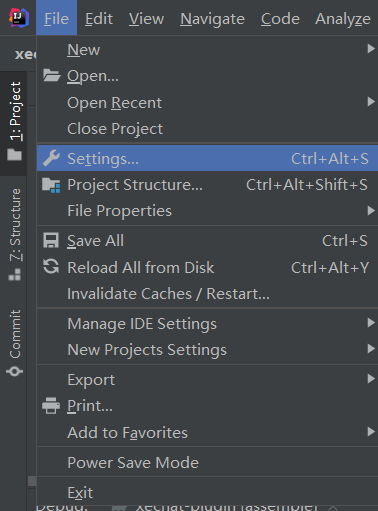
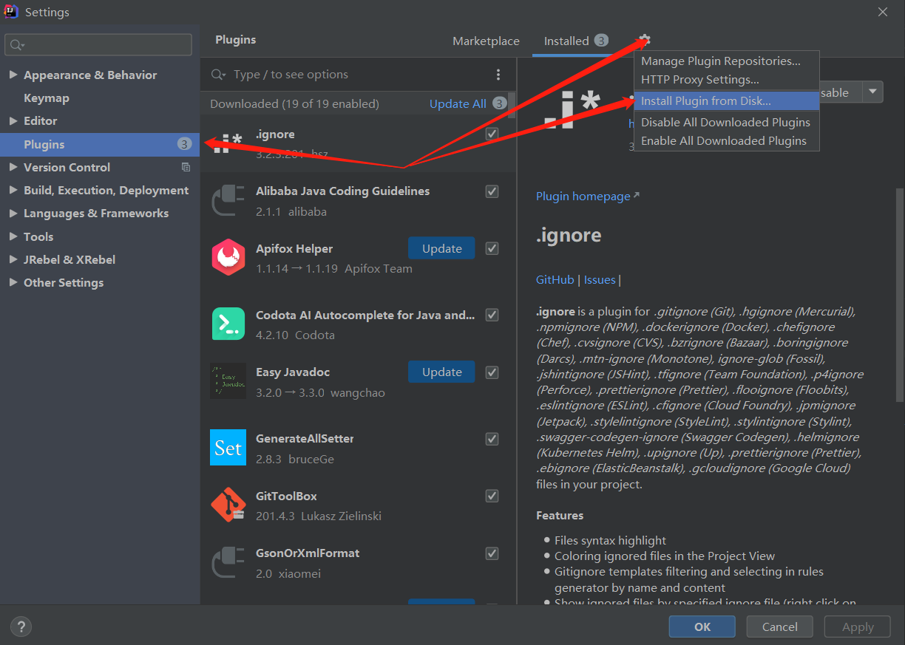
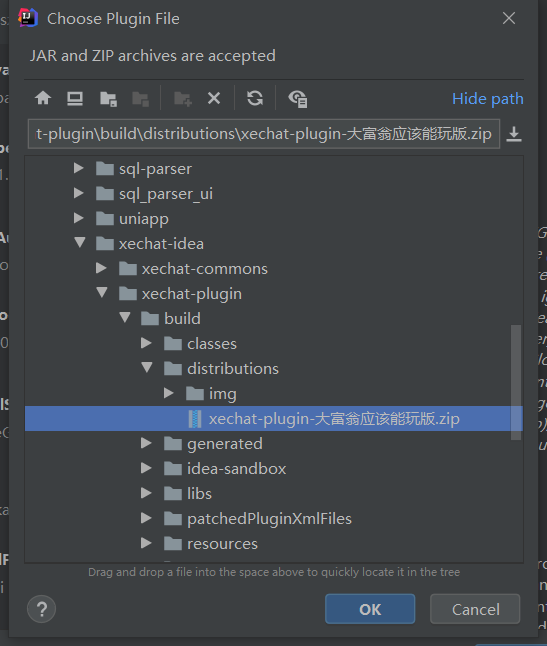

# 1. 安装使用

1. 点击左上角的 `File` 选中`Settings` 



2. 找到配置中的`Plugins`



3. 找到压缩包位置安装 **<font color=red>不用解压不用解压不用解压</font>**



## 2. 链接使用

## 1. 链接测试服务器

1. 连接到测试服务器

```sh
# 默认也会链接到这个鱼塘
#login 大骨熬成汤 -h chargeduck.lesscoding.net -p 1024
```

2. 查看游戏并游玩

```sh
#showGame
# 大富翁7 UNO 8
#play 7
```

## 2. 连接到官方服务器

```sh
# 退出登录
#exit 
# 查看服务器列表
#showServer 
# 登录
#login 大骨熬成汤 -s 0
```


